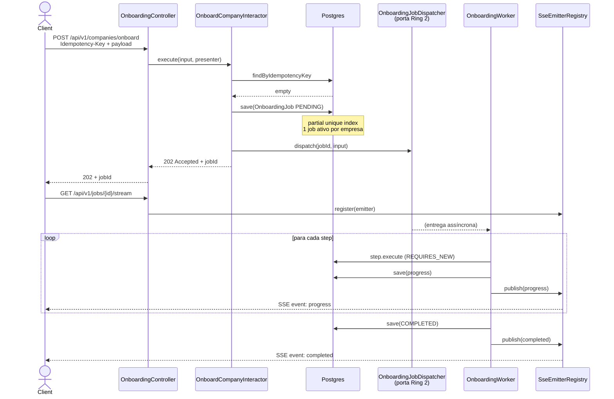
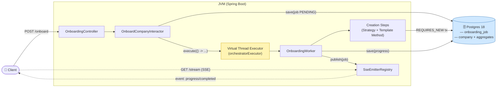
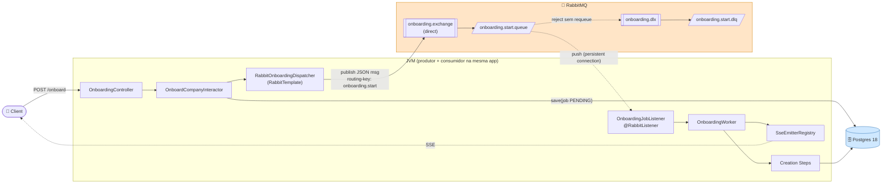
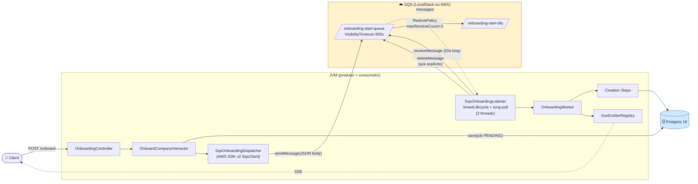
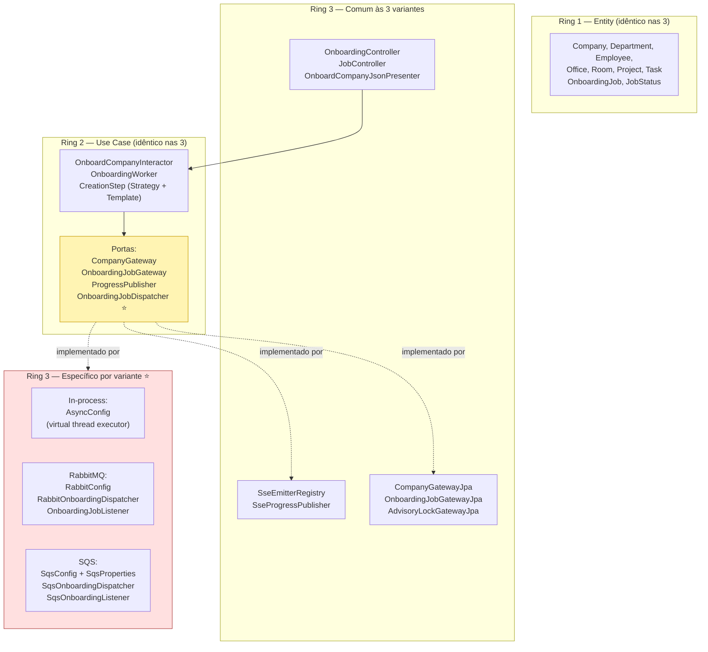

# Diagramas de arquitetura — as três variantes

Este documento apresenta, em diagramas Mermaid, a visão de alto nível das três
variantes do onboarding e o que muda entre elas. Para trade-offs detalhados
veja [`ASYNC_COMPARISON.md`](ASYNC_COMPARISON.md).

---

## Fluxo comum (idêntico nas três variantes)

Todo o *happy path* visto do cliente é o mesmo. A diferença está na seta
`dispatch` — quem entrega o trabalho ao worker muda de variante para variante.

---

## Variante 1 — In-process (Postgres + Virtual Thread)

**O que caracteriza esta variante**
- Despacho = **closure numa virtual thread**. Mesma JVM, mesma memória.
- Fila de trabalho não existe fora do JVM — se o processo cai, o *trigger*
  some. O job fica `IN_PROGRESS` no DB e precisaria de um reaper.
- Infra extra: zero. Só Postgres.

---

## Variante 2 — RabbitMQ

**O que caracteriza esta variante**
- Despacho = **mensagem JSON num exchange**. Broker persiste; mesmo se o
  consumer cair, a mensagem fica.
- Push-based: o broker **entrega** para consumers conectados.
- Dead Letter Exchange configurado na queue para poison messages.
- Escala horizontal: basta subir mais instâncias — todas se registram na
  mesma queue e o broker distribui (round-robin com prefetch).

---

## Variante 3 — AWS SQS (LocalStack local)

**O que caracteriza esta variante**
- Despacho = **mensagem numa fila gerenciada**. Sem servidor próprio.
- **Pull-based**: threads dedicadas fazem long-poll (20s, o máximo) contra
  `ReceiveMessage`. Zero mensagens na fila → zero custo significativo.
- Ack explícito via `DeleteMessage`. Sem delete = redelivery após
  VisibilityTimeout. `RedrivePolicy` move pra DLQ após 3 tentativas.

---

## O que muda entre as variantes

A Clean Architecture isola a variação exatamente em **uma porta Ring 2 e uma
caixa Ring 3**. O diagrama abaixo mostra isso:

⭐ = ponto de variação. A única porta Ring 2 que tem implementações diferentes
entre os três projetos é `OnboardingJobDispatcher`. Tudo o mais é código
idêntico.

---

## Tabela comparativa

| Dimensão | **Variante 1** In-process + Postgres | **Variante 2** RabbitMQ | **Variante 3** SQS |
|---|---|---|---|
| **Modelo** | Fire-and-forget em virtual thread | Push (broker entrega) | Pull (consumer faz long-poll) |
| **Infra extra** | Nenhuma | Broker RabbitMQ | Conta AWS ou LocalStack |
| **Durabilidade do trigger** | ❌ Perde se a JVM cair | ✅ Broker persiste | ✅ AWS persiste (replicação multi-AZ) |
| **Entrega** | Exactly-once local | At-least-once + acks | At-least-once + visibility timeout |
| **Retry automático** | ❌ Não | ⚠️ Configurável (desligado aqui) | ✅ Built-in via RedrivePolicy |
| **DLQ** | ❌ Inexistente | ✅ Dead Letter Exchange | ✅ Nativa |
| **Latência dispatch → execução** | µs (mesma JVM) | ms (push) | dezenas a centenas de ms (polling batch) |
| **Throughput máximo** | Limitado por 1 JVM | Dezenas de milhares/s por broker | Praticamente ilimitado |
| **Scale horizontal** | ❌ Cada JVM só processa o que recebeu | ✅ N consumers, broker distribui | ✅ N consumers, fila distribui |
| **Ordenação** | Ordem de submissão (1 JVM) | Por fila; nenhuma com concurrency>1 | Standard: best-effort / FIFO: estrita por group-id |
| **Observabilidade** | Logs da app | Management UI (:15672), métricas Prometheus | CloudWatch nativo |
| **Backpressure** | ❌ Só a memória | ✅ Broker enche, pode rejeitar | ✅ Retém até 14 dias |
| **Ordem de grandeza do custo** | $0 marginal | $-$$ (hospedar broker) | $-$$ (por milhão de msgs) |
| **Vendor lock** | Nenhum | Baixo (AMQP é padrão) | Alto (SQS-específico) |
| **Complexidade operacional** | Baixíssima | Média (cluster, upgrades, disk, memory alarms) | Quase zero (gerenciado) |
| **Multi-região** | N/A | Federation / shovel (setup manual) | Cross-region replication nativa |
| **Quando usar** | MVP, single-node, jobs curtos | On-prem/k8s, controle fino, latência baixa | AWS-native, zero-ops, cargas bursty |
| **Onde quebra** | Crash da JVM = job órfão | Operação do broker | At-least-once força idempotência |

**Legenda**: ✅ ponto forte · ⚠️ depende de configuração · ❌ ausente ou problemático

---

## Conclusão em uma frase

> **A arquitetura Clean Architecture permitiu que, com a mesma base de Ring 1
> e Ring 2, trocar o mecanismo de despacho assíncrono se resumisse a uma porta
> (`OnboardingJobDispatcher`) e seus adaptadores — nada além disso muda entre
> as três variantes.**

Para trade-offs aprofundados, leia
[`ASYNC_COMPARISON.md`](ASYNC_COMPARISON.md). Para os patterns aplicados no
código (Strategy, Template Method, Observer, Presenter, etc.) e como cada um
funciona por baixo, leia
[`company-onboarding/APROFUNDAMENTO.md`](company-onboarding/APROFUNDAMENTO.md).
